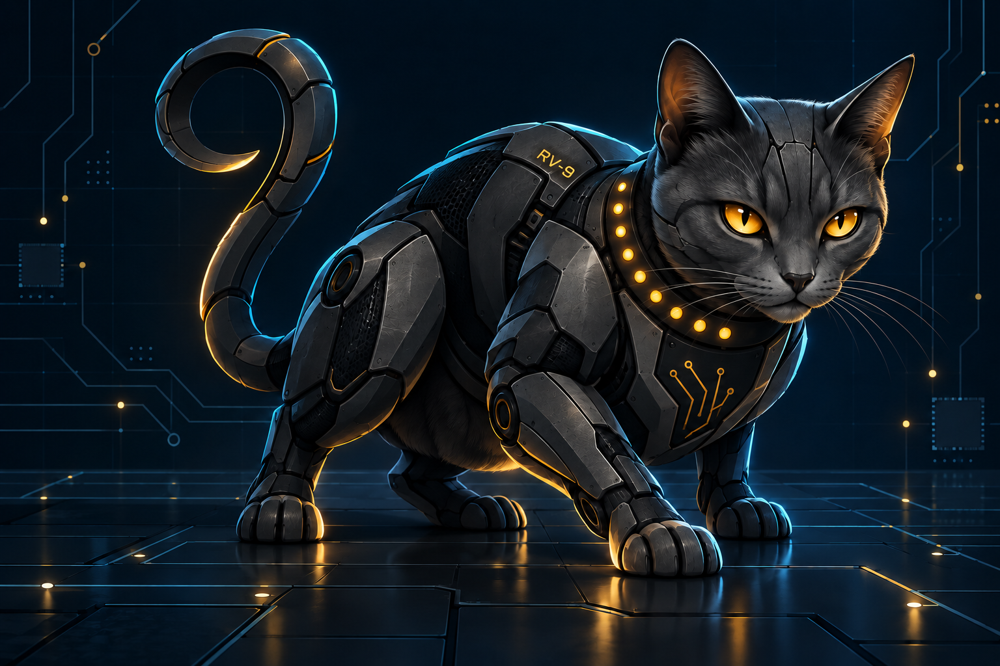

# RV-9



*Nine lives, the finest motion control in nature, and a well-known
disinclination to take orders from anyone. RV-9 is an independent project;
see [Name and trademarks](#name-and-trademarks).*

**A small modular operating system for RISC-V, built to run the machines that
move. Its design is inspired by the classic OS-9 architecture.**

RV-9 runs on an ESP32-C5: one RISC-V core at 240 MHz, WiFi 6, 4 MB of flash,
and about a quarter of a megabyte of RAM, with no PSRAM. Everything above
the kernel is a module that is loaded at runtime. That includes the shell
and every command. RV-9 has its own
scheduler, a unified I/O system in which the network, storage, GPIO pins,
the screen and published sensor values are all paths, an SSH server, and a
real-time class that *admits* control loops only when it can show they will
meet their deadlines.

It is also the first target of
[**Rachis9 (R9)**](https://github.com/Solifugus/r9), a language for
autonomous real-world systems such as drones and robots. R9 components
declare their period, deadline, cost, memory and the devices they own, and
RV-9 enforces those declarations. R9 is still a design; RV-9 is the half
that runs.

RV-9 is not OS-9. It is an independent project, not affiliated with or
endorsed by the owner of OS-9, and it contains no OS-9 code. It has no
binary compatibility and cannot run OS-9 software. It borrows general
architectural ideas, credited below, and nothing else. See
[Name and trademarks](#name-and-trademarks).

From the board's boot log. A loop with 2 ms of work every 5 ms, which must
answer within 3 ms, runs beside a loop with 15 ms of work every 100 ms:

```
--- a fast loop beside a heavy one, priority derived ---
  pass  admitting the fast loop moved the running heavy loop below it
  (bounds: fast 2500 us, heavy 38000 us)
  (fast loop's worst response 2022 us, status 0)
  pass  the fast loop met every deadline beside the heavy one
--- the same, at one priority: the control ---
  (fast loop's worst response 4294967295 us, status -13)
  pass  at one priority it answers later than when placed by deadline
--- admission by deadlines, not utilisation ---
  pass  a loop that fits the CPU but not the deadlines is refused
--- when ordinary memory is gone ---
  (took 105 x 512 bytes; 8612 left above the floor)
  pass  an ordinary program cannot start now
  pass  but a control loop is still admitted
  pass  the loop is stopped with every reserve above the floor gone
  pass  and its pin was still parked
```

At a single priority, the fast loop missed a deadline and was stopped
(`-13` is DEADLINE).

---

## What makes it different

### Code is a runtime object
Programs, drivers, file managers and device descriptors are
**position-independent memory modules**. Each is CRC-checked, versioned, and
found by name in a module directory. A module can be fetched over WiFi,
written to flash, and run after a reboot without the firmware ever being
reflashed. Each module carries a TLV **manifest** that says what it needs:
stack, statics, period, deadline, worst-case execution time, exclusive
devices, publications, failsafe states, and a memory budget.

### Small tools that compose
A pipe is a file manager, the way OS-9 did it -- so `|` in the shell costs
two opens and a fork, and every program that reads standard input and
writes standard output composes through one without being changed:

```
rv9> mdir | field 2 | sort | unique
descrip
program
type

rv9> procs | match active | field 3
match / procs / shell / sshd

rv9> log | match error | last 20
```

Commands decide, and a file of them is a script the shell runs — `#` for a
comment, `exit n` for the answer it hands back:

```
rv9> range 11 || echo no sensor answered
rv9> shell /f0/checkout && echo the board is fit to fly
```

Thirteen tools, whole words rather than abbreviations: `match` `count`
`first` `last` `field` `sort` `unique` `copy` `move` `info` `dump` `log`
`date`. Each states its limits and refuses rather than answering with part
of the truth -- `sort` will not return your lines shortened, and says so.

### Everything is a path
File managers, drivers and device descriptors are separate, independently
loadable pieces:

| path | what it is |
|---|---|
| `/term`, `/uart0` | console panel (ST7789) and serial, through SCF |
| `/r0`, `/f0`, `/sd0` | RAM disk, flash filesystem and microSD card, through RBF (`dir`, `df`, `format`) |
| `/n0/host/port` | a TCP connection; `/n0/listen/port` accepts |
| `/ssh0` | SSH sessions, as a character device |
| `/pipe/name` | a pipe -- what one program writes, another reads |
| `/gpio/N`, `/pwm0`, `/adc0`, `/tsens` | hardware; a pin reports edges, and the interrupt times the pulse between them |
| `/i2c0/0x68` | a chip on the two-wire bus, through IFM; the register lives on the path so a read is one transaction |
| `/w0` | a window you draw on by writing SVG to it |
| `/pub0/NAME` | a published value with an owner and a sequence number |

### Real-time work is admitted, not started
- **Admission** is based on response-time analysis, not just CPU
  utilisation. A loop that fits the CPU but would make another loop late is
  refused, and the log names which loop and by how much.
- **Priority is derived** from deadlines. Admitting a tight loop can move a
  heavy one below it. A program can pin itself `urgent` or `routine`,
  but a pin constrains the analysis rather than overriding it: if the pin
  would make any loop late, the program is refused.
- **Deadline misses and runaway loops are enforced.** A 2 ms watchdog stops
  a loop that stops waiting for its releases. The loop's declared
  **failsafes** are applied (the motor is parked) and the fault is
  published into its cell, so that watchers learn of it.
- **Device ownership.** A module can declare a device exclusive, and a
  second owner is refused before it runs.
- **Memory classes and budgets.** Ordinary work is refused 8 KB before a
  real-time loop would be, and the failsafe path goes lower still. Every
  process, with everything it starts, has a budget, so a runaway `fork`
  stops at its own limit instead of taking the machine down.

### A contract a compiler can read
[`docs/target/rv9-profile.json`](docs/target/rv9-profile.json) is generated
from the sources. It lists the module ABI, every manifest tag and whether
the firmware enforces it, every system call and whether it is real-time
safe, the fault codes, and the limits. The `profile` command prints the
board's own half as JSON. The host tests fail if the committed profile
goes stale.

### Honest about what it measures
Every claim in the design document has a test behind it, and those tests
run at every boot on the hardware. Where the first version of a test was
wrong, or a number was worse than hoped, the document says so.

---

## Architecture

```
   ┌──────────────────────────────────────────────┐
   │  modules — shell, commands, daemons, loops   │
   ├──────────────────────────────────────────────┤
   │  RV-9 personality                            │
   │    module manager   format, directory, load  │
   │    process manager  fork, wait, kill, budgets│
   │    I/O manager      paths, file mgrs, drivers│
   │    real-time        admission, watchdog      │
   ├──────────────────────────────────────────────┤
   │  KAL — kernel abstraction layer  ◄── the seam│
   ├──────────────────────────────────────────────┤
   │  rv9_kernel (native)  |  FreeRTOS (reference)│
   ├──────────────────────────────────────────────┤
   │  ESP32-C5 hardware, ESP-IDF drivers, WiFi    │
   └──────────────────────────────────────────────┘
```

No source file above the KAL may include a FreeRTOS header, and
`tools/check_layering.sh` fails the build if one does. The whole system
(processes, I/O, storage, networking and the shell) runs on RV-9's own
kernel. That kernel passes the same KAL conformance suite as FreeRTOS,
which is kept as a reference. FreeRTOS still hosts the kernel in one task
and runs the ESP-IDF drivers and the closed WiFi blobs; removing it
entirely is the remaining kernel work.

| component | role |
|---|---|
| `components/rv9_kal` | the abstraction layer: tasks, locks, queues, timers, memory floors and classes, real-time slots and watchdog |
| `components/rv9_kernel` | the native kernel: RV32 context switch, run queues with aging, its own tick and allocator |
| `components/rv9_module` | module format, manifest, directory, loader, the system-call table |
| `components/rv9_proc` | processes: fork, wait, kill, admission, derived priority, budgets, faults |
| `components/rv9_io` | I/O manager, file managers (SCF, RBF, NFM, PIO, PFM, PIPE, IFM) and drivers |
| `components/rv9_ssh` | SSH transport, authentication and channels, as a device |
| `modules/` | about seventy modules: shell, commands, daemons, descriptors, test loops |
| `main/` | bring-up and the boot test suites |

---

## Tested on the hardware at every boot

```
kal 45   conform 27   mod 17   io 44   pub 38
fault 76   proc 11   sched 15   mem 13   sd 7
```

The boot suites cover the following:
- **conform**: the KAL contract, run on both kernels.
- **fault**: kill, deadline misses, runaways, and faults published into
  cells.
- **proc**: process lifetime, history, and pid reuse.
- **sched**: derived priority, measured against a control run at a single
  priority.
- **mem**: memory used up on purpose, to show a control loop is still
  admitted, a dying loop's pin is still parked, and a fork bomb stops at
  its budget.
- **sd**: the microSD card -- mounted, written, read back, and survived a
  reboot.

Beyond the boot suites, four soak runs totalling 26 hours have driven the
board over SSH with a 100 Hz control loop, pipelines, flash round trips
and session churn: **1,318 real-time loop rounds, every deadline met**, and
no panic, reboot, WiFi disconnect or stack overflow in any of them.

On the host, `tools/hosttest/run.sh` checks path parsing, the SVG
rasteriser and the target profile.

---

## Building

Requires ESP-IDF v6.0.3 and an ESP32-C5 board. Development uses the
Waveshare ESP32-C5-LCD-1.47.

```sh
. ~/esp/esp-idf/export.sh
idf.py build                            # firmware
./tools/build_modules.sh                # modules -> build/modules.bin
idf.py -p /dev/ttyACM0 flash
./tools/flash_modules.sh /dev/ttyACM0   # the module store
idf.py -p /dev/ttyACM0 monitor
```

The console shell is on USB serial. Once on a network:

```
rv9> wifi <ssid> <password>
rv9> passwd <password>        # for SSH login
$ ssh demo@<board-address>
```

`authkey` trusts a public key for SSH. Use ECDSA P-256 or RSA; mbedTLS as
shipped has no Ed25519.

---

## Documents

Three of them do three different jobs, and it is worth knowing which you
want:

- [**Tutorial**](docs/tutorial.md): learning it with a board in front of
  you — build, boot, the shell, paths, pipes, scripts, then writing a module
  and giving it a real-time contract. *Being written.*
- [**Reference**](docs/reference.md): looking it up — paths, the file manager
  disciplines, the module format, all twenty manifest tags, the thirty-four
  environment calls, faults and errors, limits. *Being written.*
- [**Design**](docs/design.md): why, and what went wrong on the way. The
  architecture and the story of how each piece was built, measured and
  corrected — admission, device ownership, failsafes, publication, kill,
  runaways, derived priority, the target profile, memory, and the attempts
  that were abandoned with the reasoning kept.
- [**Roadmap**](docs/roadmap.md): phases, what is done, and what is next.
- [**Memory**](docs/memory.md): where every kilobyte goes, measured on the
  board.
- [**Alignment**](docs/alignment.md): notes from the
  [R9](https://github.com/Solifugus/r9) side, and where RV-9 stands against
  each one.

## Licence

Apache License 2.0 — see [LICENSE](LICENSE) and [NOTICE](NOTICE).

The name and the mascot are not covered by that licence; see
[Name and trademarks](#name-and-trademarks).

## Status

Working on the hardware: modules, processes, I/O, RAM disk, flash and
microSD storage, networking, an SSH server, an SVG window, GPIO/PWM/ADC,
I²C, pulse timing measured in the interrupt handler, publication, a shell
with pipes, redirection, scripts and conditional execution, a complete set
of small tools, a clock taken from the network, and the real-time class with
admission, derived priority, watchdog, failsafes and memory reserves.

Verified as mechanisms but not yet against real parts: **I²C** has only
talked to an empty bus, and the **sonic ranger** command has only been
measured against a generator on a pin (exact to 2 µs, see design §51). Both
are waiting on a chip to answer.

Still to come:
- **The kernel owning the CPU from reset**, with its own trap vector and
  asynchronous preemption
- **WiFi on RV-9's own primitives** (`wifi_osi_funcs_t`)
- **PMP memory isolation between processes**

Attempted and abandoned, with the reasoning kept: asynchronous preemption
while RV-9 is a guest. The mechanism worked and then hung the machine three
times, and the cause is architectural rather than a bug — the stub's `mret`
is a second trap return for a trap the host already returned from, and on
this chip that pops a hardware interrupt-level stack that was only pushed
once. See design §47. It waits for the kernel to own the trap.

## Name and trademarks

OS-9 is a trademark of its respective owner. RV-9 is not OS-9, is not a
version, port or derivative of it, and is not affiliated with, sponsored by
or endorsed by the owner of OS-9. The name OS-9 appears in this repository
only to acknowledge where some of RV-9's design ideas came from: memory
modules, and the split between file managers, drivers and device
descriptors. Occasionally it is also used for historical comparison. RV-9
shares no code, file formats or binary interfaces with OS-9.

## Author

Matthew C. Tedder.
